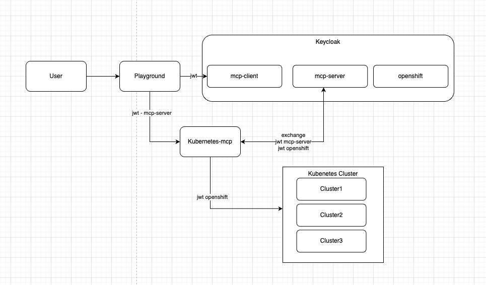

# Kubernetes MCP Server OAuth Configuration Guide

This guide explains how to configure the Kubernetes MCP Server to use OAuth authentication with Keycloak and run operations using user context instead of service account credentials.

## Overview

The Kubernetes MCP Server can be configured to use OAuth2/OIDC authentication with Keycloak. When configured with `require_oauth = true`, the server:

1. Accepts OAuth tokens from clients
2. Performs token exchange with Keycloak to obtain Kubernetes/OpenShift tokens
3. Uses the user's identity to perform Kubernetes operations (user context)
4. Respects the user's RBAC permissions in the cluster

This enables fine-grained access control where each user's operations are limited by their individual Kubernetes RBAC permissions.

## Prerequisites

- **OpenShift 4.19 or later** (required for External Authentication - Tech Preview feature)
- OpenShift/Kubernetes cluster access with cluster-admin privileges
- `oc` CLI tool installed and configured
- `kustomize` installed
- `jq` installed (for testing)
- `envsubst` installed (usually included with `gettext` package)
- Access to the `llama-stack` namespace (or create it)

> **⚠️ Important**: This setup uses External Authentication, which is a **Tech Preview feature** available in OpenShift 4.19+. See the [Keycloak Setup Guide](redhat-bk/README.md) for detailed information about prerequisites, limitations, and deployment steps.

## Architecture



The architecture diagram above illustrates the complete authentication and authorization flow. Below is a detailed explanation:

### Authentication Flow

```
User → Playground → Keycloak (mcp-client) → JWT Token
                ↓
         Kubernetes MCP Server → Keycloak (mcp-server) → Token Exchange → OpenShift Token → Kubernetes Cluster
```

### Detailed Flow Description

1. **User → Playground**: User accesses the Llama Stack Playground application
2. **Playground → Keycloak (mcp-client)**: Playground authenticates with Keycloak using the `mcp-client` public client and receives a JWT token with `mcp-server` scope
3. **Playground → Kubernetes MCP Server**: Playground sends requests to MCP Server with the JWT token (audience: `mcp-server`)
4. **Kubernetes MCP Server → Keycloak (mcp-server)**: MCP Server performs token exchange with Keycloak's `mcp-server` confidential client:
   - Sends the user's JWT token (subject token)
   - Requests token exchange for `openshift` audience
   - Requests `mcp:openshift` scope
5. **Keycloak → Kubernetes MCP Server**: Keycloak returns a new JWT token with:
   - Audience: `openshift`
   - Scope: `mcp:openshift`
6. **Kubernetes MCP Server → Kubernetes Cluster**: MCP Server uses the OpenShift JWT token to make Kubernetes API calls as the authenticated user

### Key Components

- **Playground**: User-facing application that authenticates users via Keycloak
- **Keycloak**: Identity provider with three clients:
  - `mcp-client`: Public client for user authentication
  - `mcp-server`: Confidential client for token exchange
  - `openshift`: Client for OpenShift API authentication
- **Kubernetes MCP Server**: Server that performs token exchange and makes Kubernetes API calls using user context
- **Kubernetes Cluster**: Target cluster(s) where operations are performed with user's RBAC permissions

## Step-by-Step Configuration

This guide uses template files with environment variable substitution (`envsubst`) to configure the components. All configuration files use `${VARIABLE_NAME}` placeholders that are replaced at deployment time.

### Step 1: Deploy Keycloak Instance and Realm

First, deploy Keycloak and configure the realm with the necessary clients. This setup uses **External Authentication** (Tech Preview feature for OpenShift 4.19+).

> **📖 For detailed Keycloak setup instructions, see the [Keycloak Setup Guide](redhat-bk/README.md)**

**Deploy Keycloak**:

```bash
cd redhat-bk
./script.sh
```

This script will:
- Enable Tech Preview features via FeatureGate (required for External Authentication)
- Deploy the Red Hat Build of Keycloak operator
- Create a PostgreSQL database
- Deploy Keycloak instance
- Configure the `openshift` realm with:
  - `mcp-client`: Public client for MCP clients to authenticate
  - `mcp-server`: Confidential client for token exchange
  - `openshift`: Client for OpenShift API authentication
  - `openshift-cli`: Public client for CLI authentication
- Configure External Authentication for OpenShift
- Extract and create Keycloak CA certificate ConfigMap

**Important**: 
- **OpenShift 4.19+ is required** for External Authentication
- **Save the generated secrets** displayed by the script output:
  ```bash
  MCP_SERVER_SECRET=<generated-uuid>
  MCP_CLIENT_SECRET=<generated-uuid>
  OPENSHIFT_SECRET=<generated-uuid>
  OPENSHIFT_CONSOLE_SECRET=<generated-uuid>
  CLUSTER_NAME=<your-cluster-name>
  ```
- The FeatureGate cannot be disabled once enabled

### Step 2: Set Environment Variables

Before running the main deployment script, export the secrets from Step 1:

```bash
# Get cluster name (auto-detected by script, but can be set manually)
export CLUSTER_NAME=$(oc get infrastructure cluster -o jsonpath='{.status.apiServerURL}' 2>/dev/null | sed 's|https://api\.||' | sed 's|:6443||' || echo "")

# Export secrets from Keycloak deployment (from redhat-bk/script.sh output)
# These are REQUIRED - the script will fail if not set
export MCP_SERVER_SECRET=<your-mcp-server-secret>  # From redhat-bk/script.sh output
export MCP_CLIENT_SECRET=<your-mcp-client-secret>  # From redhat-bk/script.sh output

# Cookie secret is auto-generated by the script, but can be set manually
export COOKIE_SECRET=$(openssl rand -base64 24)  # Optional - script generates if not set
```

**Note**: The script will auto-detect `CLUSTER_NAME` if not set, but `MCP_SERVER_SECRET` and `MCP_CLIENT_SECRET` must be exported before running the script.

### Step 3: Deploy All Components

Run the main deployment script from the root directory:

```bash
./script.sh
```

This script will:

1. **Kubernetes MCP Server Setup**:
   - Uses `mcp-openshift/base/configmap.yaml.template` with `envsubst`
   - Generates `configmap.yaml` with substituted values
   - Creates Keycloak CA certificate ConfigMap
   - Deploys MCP Server with OAuth configuration

2. **OpenShift AI Setup**:
   - Deploys OpenShift AI operator (stable-2.25)
   - Deploys OpenShift AI instance

3. **Llama Stack Setup**:
   - Copies `llama-stack-secret.yaml.template` to `llama-stack-secret.yaml`
   - Uses `llama-stack/base/configmap.yaml.template` with `envsubst`
   - Generates `configmap.yaml` with substituted values
   - **Note**: You need to manually update `llama-stack-secret.yaml` with actual API tokens

4. **Llama Stack Playground Setup**:
   - Generates a random cookie secret using `openssl rand -base64 24`
   - Replaces `GENERATE_RANDOM_BASE64_STRING` placeholder in `values.yaml` with generated cookie secret (if placeholder exists)
   - Changes directory to `llama-stack-playground/chart/llama-stack-playground`
   - Uses `values.yaml.template` with `envsubst` to generate `values.yaml` (substitutes `${CLUSTER_NAME}`, `${MCP_CLIENT_SECRET}`, `${COOKIE_SECRET}`)
   - Deploys using Helm via Kustomize from `llama-stack-playground/overlay`

### Step 4: Template Files Configuration

The deployment uses template files that need environment variable substitution:

#### MCP Server Configuration

**Template**: `mcp-openshift/base/configmap.yaml.template`

The template uses `${CLUSTER_NAME}` and `${MCP_SERVER_SECRET}` variables:

```yaml
data:
  config.toml: |
    # OAuth/OIDC Configuration
    require_oauth = true
    authorization_url = "https://keycloak-admin.apps.${CLUSTER_NAME}/realms/openshift"
    oauth_scopes = ["openid", "mcp-server"]
    sts_client_id = "mcp-server"
    sts_client_secret = "${MCP_SERVER_SECRET}"
    sts_audience = "openshift"
    sts_scopes = ["mcp:openshift"]
    certificate_authority = "/etc/pki/keycloak-ca/ca.crt"
    oauth_audience = "account"
    validate_token = false
```

#### Llama Stack Configuration

**Template**: `llama-stack/base/configmap.yaml.template`

The template uses `${CLUSTER_NAME}` for Keycloak URLs.

#### Llama Stack Playground Configuration

**File**: `llama-stack-playground/chart/llama-stack-playground/values.yaml`

The values file uses environment variable substitution with `envsubst`:
- `${CLUSTER_NAME}` for Keycloak URL and redirect URL
- `${MCP_CLIENT_SECRET}` for Keycloak client secret
- `${COOKIE_SECRET}` for OAuth2-proxy cookie secret (auto-generated by script if not set)

### Step 5: Verify Deployment

Check that all components are running:

```bash
# Check MCP Server
oc get pods -n llama-stack -l app=ocp-mcp-server
oc logs -n llama-stack -l app=ocp-mcp-server --tail=50

# Check OpenShift AI
oc get pods -n redhat-ods-applications

# Check Llama Stack
oc get pods -n llama-stack -l app=llama-stack

# Check Llama Stack Playground
oc get pods -n llama-stack -l app.kubernetes.io/name=llama-stack-playground
```

You should see logs indicating OAuth is enabled:
```
OAuth required: true
Authorization URL: https://keycloak-admin.apps...
```

## Quick Start (Automated Deployment)

For a complete automated deployment, use the main script:

```bash
# Step 1: Deploy Keycloak (run once, save the secrets)
cd redhat-bk
./script.sh
# Save the output secrets displayed:
#   MCP_SERVER_SECRET=<generated-uuid>
#   MCP_CLIENT_SECRET=<generated-uuid>
#   OPENSHIFT_SECRET=<generated-uuid>
#   OPENSHIFT_CONSOLE_SECRET=<generated-uuid>
#   CLUSTER_NAME=<your-cluster-name>

# Step 2: Set environment variables (REQUIRED before running main script)
cd ..
export CLUSTER_NAME=$(oc get infrastructure cluster -o jsonpath='{.status.apiServerURL}' | sed 's|https://api\.||' | sed 's|:6443||')
export MCP_SERVER_SECRET=<from-step-1-output>
export MCP_CLIENT_SECRET=<from-step-1-output>
# COOKIE_SECRET is optional - script will generate if not set
export COOKIE_SECRET=$(openssl rand -base64 24)

# Step 3: Deploy all components
./script.sh
```

**Important Notes**:
- The script auto-detects `CLUSTER_NAME` if not exported
- `MCP_SERVER_SECRET` and `MCP_CLIENT_SECRET` **must** be exported before running
- The script uses `envsubst` to substitute environment variables in template files
- Template files must exist: `configmap.yaml.template` files and `values.yaml.template` (if used)

## Running the Server Locally (Development)

For local development and testing:

### 1. Build the Server

```bash
cd ../kubernetes-mcp-server  # Navigate to the server source
make build
```

### 2. Create Configuration File

Create a `config.toml` file:

```toml
port = "8080"
cluster_provider_strategy = "kubeconfig"
kubeconfig = "/path/to/your/kubeconfig"

log_level = 2
list_output = "table"
toolsets = ["core", "config", "helm"]
read_only = false
disable_destructive = false

# OAuth/OIDC Configuration
require_oauth = true
authorization_url = "https://keycloak-admin.apps.<YOUR_CLUSTER_NAME>/realms/openshift"
oauth_scopes = ["openid", "mcp-server"]
sts_client_id = "mcp-server"
sts_client_secret = "<MCP_SERVER_SECRET>"
sts_audience = "openshift"
sts_scopes = ["mcp:openshift"]
certificate_authority = "/path/to/keycloak-ca.crt"
oauth_audience = "account"
validate_token = false
```

### 3. Run the Server

```bash
./kubernetes-mcp-server --port 8080 --require-oauth --config config.toml
```

Or use command-line flags:

```bash
./kubernetes-mcp-server \
  --port 8080 \
  --require-oauth \
  --authorization-url "https://keycloak-admin.apps.<YOUR_CLUSTER_NAME>/realms/openshift" \
  --oauth-scopes "openid,mcp-server" \
  --sts-client-id "mcp-server" \
  --sts-client-secret "<MCP_SERVER_SECRET>" \
  --sts-audience "openshift" \
  --sts-scopes "mcp:openshift" \
  --certificate-authority "/path/to/keycloak-ca.crt" \
  --oauth-audience "account"
```

## Testing the Setup

### 1. Get an OAuth Token

Authenticate with Keycloak to get an OAuth token:

```bash
export CLUSTER_NAME=$(oc get infrastructure cluster -o jsonpath='{.status.apiServerURL}' | sed 's|https://api\.||' | sed 's|:6443||')
export RHBK_HOST="https://keycloak-admin.apps.${CLUSTER_NAME}"
export RHBK_REALM="openshift"
export RHBK_USERNAME="testdeveloper"  # User created in Keycloak
export RHBK_PASSWORD="<password>"
export MCP_CLIENT_ID="mcp-client"
export MCP_CLIENT_SECRET="<MCP_CLIENT_SECRET>"  # From redhat-bk/script.sh output

RHBK_TOKEN=$(curl -s -X POST ${RHBK_HOST}/realms/${RHBK_REALM}/protocol/openid-connect/token \
    -H 'Content-Type: application/x-www-form-urlencoded' \
    -d scope=mcp-server \
    -d username=${RHBK_USERNAME} \
    -d password=${RHBK_PASSWORD} \
    -d grant_type=password \
    -d client_id=${MCP_CLIENT_ID} \
    -d client_secret=${MCP_CLIENT_SECRET} | jq -r '.access_token')

echo "Token: $RHBK_TOKEN"
```

### 2. Test Token Exchange (Server-side)

The server will automatically perform token exchange. To test manually:

```bash
export MCP_SERVER_ID="mcp-server"
export MCP_SERVER_SECRET="<MCP_SERVER_SECRET>"  # From redhat-bk/script.sh output

K8S_TOKEN=$(curl -s ${RHBK_HOST}/realms/${RHBK_REALM}/protocol/openid-connect/token \
    -d grant_type=urn:ietf:params:oauth:grant-type:token-exchange \
    -d client_id=${MCP_SERVER_ID} \
    -d subject_token="${RHBK_TOKEN}" \
    -d subject_token_type=urn:ietf:params:oauth:token-type:access_token \
    -d audience=openshift \
    -d client_secret=${MCP_SERVER_SECRET} \
    -d requested_token_type=urn:ietf:params:oauth:token-type:access_token \
    -d scope=mcp:openshift | jq -r '.access_token')

echo "K8S Token: $K8S_TOKEN"
```

### 3. Test with MCP Inspector

Use the MCP Inspector to test the server:

```bash
npx @modelcontextprotocol/inspector@latest
```

Configure it to connect to your MCP Server with the OAuth token.

### 4. Verify User Context

Check that operations are performed as the authenticated user:

```bash
export CLUSTER_NAME=$(oc get infrastructure cluster -o jsonpath='{.status.apiServerURL}' | sed 's|https://api\.||' | sed 's|:6443||')
export OPENSHIFT_API_SERVER="https://api.${CLUSTER_NAME}:6443"

curl -k -H "Authorization: Bearer ${K8S_TOKEN}" \
     "${OPENSHIFT_API_SERVER}/apis/authentication.k8s.io/v1/selfsubjectreviews" \
     -H "Content-Type: application/json" \
     -X POST -d '{"kind":"SelfSubjectReview","apiVersion":"authentication.k8s.io/v1","metadata":{"creationTimestamp":null},"status":{"userInfo":{}}}'
```

This should return the user information from the token.

## User Context vs Service Account

### Service Account Context (Default, `require_oauth = false`)

- Server uses service account credentials
- All operations use the service account's permissions
- No user-specific access control
- Simpler setup, less secure

### User Context (OAuth Enabled, `require_oauth = true`)

- Server uses user's OAuth token (via token exchange)
- Each operation uses the authenticated user's permissions
- Fine-grained access control based on user RBAC
- More secure, respects user permissions

## Keycloak Realm Configuration

The Keycloak realm includes:

### Client Scopes

- **groups**: Maps user groups to token claims
- **mcp-server**: Audience scope for MCP Server
- **mcp:openshift**: Scope for OpenShift API access

### Clients

1. **mcp-client** (Public)
   - Used by MCP clients to authenticate
   - Direct access grants enabled
   - Optional scope: `mcp-server`

2. **mcp-server** (Confidential)
   - Used by MCP Server for token exchange
   - Token exchange enabled
   - Default scope: `groups`
   - Optional scope: `mcp:openshift`

3. **openshift** (Confidential)
   - Used for OpenShift API authentication
   - Protocol mappers for username, email, groups

4. **openshift-cli** (Public)
   - Used by `oc` CLI for authentication

## Troubleshooting

### Server Not Accepting OAuth Tokens

1. Verify `require_oauth = true` in config
2. Check Keycloak URL is correct
3. Verify CA certificate is mounted correctly
4. Check server logs for OAuth errors

### Token Exchange Failing

1. Verify `MCP_SERVER_SECRET` is correct
2. Check `mcp-server` client has token exchange enabled in Keycloak
3. Verify `sts_audience` matches Keycloak client configuration
4. Check Keycloak realm logs

### Permission Denied Errors

1. Verify user has appropriate RBAC permissions
2. Check token contains correct groups/claims
3. Verify token exchange succeeded (check logs)
4. Test token directly with `kubectl` or `oc`

### CA Certificate Issues

1. Ensure `keycloak-oidc-ca` ConfigMap exists
2. Verify certificate path in config matches mount path
3. Check certificate is valid and not expired
4. For self-signed certs, set `validate_token = false` during development

## Security Considerations

1. **Secrets Management**: Store `MCP_SERVER_SECRET` securely (use Sealed Secrets, External Secrets, etc.)
2. **Token Validation**: Enable `validate_token = true` in production
3. **TLS**: Always use HTTPS for Keycloak endpoints
4. **RBAC**: Ensure users have minimal required permissions
5. **Token Expiration**: Implement token refresh in clients
6. **Audit Logging**: Enable audit logging to track user operations

## Additional Resources

- **[Keycloak Setup Guide](redhat-bk/README.md)** - Detailed guide for deploying Keycloak with External Authentication (Tech Preview)
- [Keycloak Token Exchange Documentation](https://www.keycloak.org/docs/latest/securing_apps/#_token-exchange)
- [OpenShift External Authentication Documentation](https://docs.openshift.com/container-platform/4.19/authentication/configuring-oauth-clients.html)
- [OpenShift Feature Gates](https://docs.openshift.com/container-platform/4.19/post_installation_configuration/cluster-tasks.html#cluster-feature-gates_post-install-cluster-tasks)
- [Kubernetes MCP Server Documentation](../kubernetes-mcp-server/README.md)

## Manual Configuration (Alternative to Script)

If you prefer to configure manually instead of using the script:

### 1. Configure MCP Server

```bash
export CLUSTER_NAME=$(oc get infrastructure cluster -o jsonpath='{.status.apiServerURL}' | sed 's|https://api\.||' | sed 's|:6443||')
export MCP_SERVER_SECRET=<your-mcp-server-secret>

cd mcp-openshift/base
envsubst < configmap.yaml.template > configmap.yaml
oc apply -k .
```

### 2. Configure Llama Stack

```bash
export CLUSTER_NAME=$(oc get infrastructure cluster -o jsonpath='{.status.apiServerURL}' | sed 's|https://api\.||' | sed 's|:6443||')

cd llama-stack/base
cp llama-stack-secret.yaml.template llama-stack-secret.yaml
# Edit llama-stack-secret.yaml with actual API tokens
envsubst < configmap.yaml.template > configmap.yaml
cd ../overlay
oc apply -k .
```

### 3. Configure Llama Stack Playground

```bash
export CLUSTER_NAME=$(oc get infrastructure cluster -o jsonpath='{.status.apiServerURL}' | sed 's|https://api\.||' | sed 's|:6443||')
export MCP_CLIENT_SECRET=<your-mcp-client-secret>
export COOKIE_SECRET=$(openssl rand -base64 24)

cd llama-stack-playground/chart/llama-stack-playground

# Generate cookie secret
cookieSecret=$(openssl rand -base64 24)
sed -i '' 's|cookieSecret: "GENERATE_RANDOM_BASE64_STRING"|cookieSecret: "'${cookieSecret}'"|g' values.yaml

# Substitute environment variables (if template exists)
if [ -f values.yaml.template ]; then
    envsubst < values.yaml.template > values.yaml
else
    envsubst < values.yaml > values.yaml.tmp && mv values.yaml.tmp values.yaml
fi

cd ../../overlay
kustomize build --enable-helm . | oc apply -f-
```

## Environment Variables Reference

The deployment scripts use the following environment variables:

| Variable | Source | Description |
|----------|--------|-------------|
| `CLUSTER_NAME` | Auto-detected or manual | OpenShift cluster domain name |
| `MCP_SERVER_SECRET` | `redhat-bk/script.sh` output | Keycloak mcp-server client secret |
| `MCP_CLIENT_SECRET` | `redhat-bk/script.sh` output | Keycloak mcp-client client secret |
| `COOKIE_SECRET` | Auto-generated or manual | OAuth2-proxy cookie encryption secret |
| `OPENSHIFT_SECRET` | `redhat-bk/script.sh` output | Keycloak openshift client secret |
| `OPENSHIFT_CONSOLE_SECRET` | `redhat-bk/script.sh` output | Keycloak openshift-console client secret |
| `POSTGRES_PASSWORD` | `redhat-bk/script.sh` output | PostgreSQL database password |

## Template Files

All configuration files use template files with `${VARIABLE}` placeholders:

- `mcp-openshift/base/configmap.yaml.template` - MCP Server OAuth configuration (uses `${CLUSTER_NAME}`, `${MCP_SERVER_SECRET}`)
- `llama-stack/base/configmap.yaml.template` - Llama Stack Keycloak configuration (uses `${CLUSTER_NAME}`)
- `llama-stack/base/llama-stack-secret.yaml.template` - Llama Stack API tokens template (manual update required after copying)
- `llama-stack-playground/chart/llama-stack-playground/values.yaml` or `values.yaml.template` - Playground Helm values (uses `${CLUSTER_NAME}`, `${MCP_CLIENT_SECRET}`, `${COOKIE_SECRET}`; script also replaces `GENERATE_RANDOM_BASE64_STRING` with generated cookie secret)

## Demo

